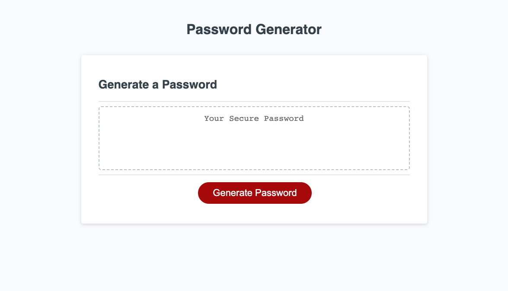
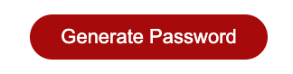

# Password Generator

## Site Screenshot

[Link to Deployed Website](https://ncguan.github.io/password-generator/)

## Technologies Used
- HTML
- CSS
- Javascript
- Git
- GitHub

## Summary
The project was built to generate a password that meets a user's password criteria. A prompt for the user to enter a password character length is presented after the button to generate a password is clicked. An alert is presented after the user enters a number from 8 to 128. The alert notifies the user that they must confirm at least one character type criteria. A series of confirm prompts are presented to the user to confirm if their password will contain a character type. Charater types include lowercase, upppercase, numeric, and special characters. Once a user confirms at least one charatcer type, a password is presented on the page.

## Usage

Click on the red 'Generate Password' button to generate a password.\

## Author Links
[GitHub](https://github.com/ncguan)